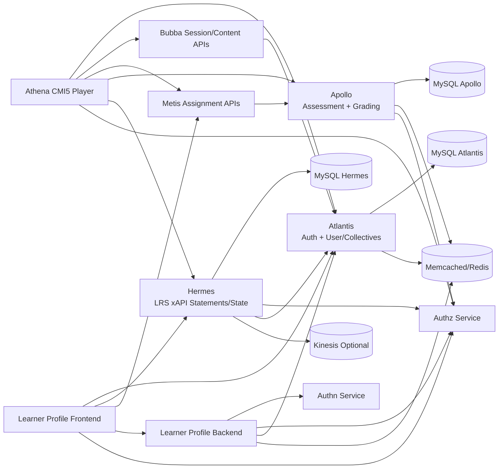

# 03 - High Level Architecture

## 1) Architecture intent
The platform is organized as cooperating domain services with mixed technology stacks:
- Identity and user-domain APIs
- Assessment lifecycle and grading
- Learning telemetry (xAPI/LRS)
- Learner profile analytics
- Frontend applications consuming all above

## 2) Service interaction map

## 3) Responsibility boundaries

## Atlantis
- Primary identity/session entry points for custom JWT and OAuth2 client credential patterns.
- User, school, class, group, term, preference APIs used by frontends.

## Apollo
- Manages test assignments, instances, interactions, submission states, and grading orchestration.
- Emits events that trigger assignment status propagation and grade passback paths.

## Hermes
- Stores/retrieves xAPI statements and activity state.
- Adds enrichment and optional stream delivery to Kinesis for downstream analytics.

## Learner-profile backend
- Skill/progression/profile APIs for student insights.
- Uses external authn/authz checks and service-to-service OAuth where needed.

## Frontends
- Athena specializes in cmi5 launch, runtime, state persistence, and statement emission.
- Learner-profile frontend specializes in student selection, profile rendering, and trend/summary views.

## 4) Data and control planes
- Control plane: authentication, authorization, policy checks, role/collective evaluation.
- Data plane: assessment responses, xAPI documents, learner progress, assignment state transitions.

## 5) Sync vs async behavior
- Sync APIs dominate user-facing flows (launch, load items, save state, fetch profile).
- Async jobs/events in Apollo handle grading and status propagation side effects.
- Hermes optionally streams telemetry events asynchronously after DB persistence.

## 6) Security posture (high level)
- Bearer JWT usage across frontends and services.
- Mixed token handling (signed JWT and opaque token introspection in Atlantis pathing).
- Optional security hash checks (IP + User-Agent) behind feature flags in multiple services.

## 7) Key architecture strengths to present in interviews
- Domain decoupling with clear responsibilities and cross-service contracts.
- Event-driven side effects where eventual consistency is acceptable.
- Telemetry-first design using xAPI state/statements and optional stream export.
- CI/CD standardization via shared GitHub reusable workflows.

## 8) Tradeoffs and known complexity
- Dual auth patterns increase compatibility but raise operational complexity.
- Legacy and modern code paths coexist in places (migration in progress indicators).
- Frontend integration depth introduces many environment dependencies.

## 9) Evidence files reviewed
- atlantis/src/main/java/atlantis/config/WebSecurity.java
- atlantis/src/main/java/atlantis/config/BecResourceServerConfiguration.java
- atlantis/src/main/java/atlantis/config/AuthorizationServerConfig.java
- apollo/routes/web.php
- apollo/app/Http/Controllers/TestInstanceController.php
- apollo/app/Listeners/ProcessBUTestInstanceUpdates.php
- hermes/backend/lrs-app/src/main/java/com/benchmarkuniverse/lrs/controller/StatementExtensionController.java
- hermes/backend/lrs-app/src/main/java/com/benchmarkuniverse/lrs/controller/StateController.java
- hermes/backend/lrs-app/src/main/java/com/benchmarkuniverse/lrs/service/impl/StatementServiceImpl.java
- learner-profile/backend/learner-profile-app/src/main/java/com/benchmarkuniverse/learnerprofile/security/LearnerProfileSecurityConfiguration.java
- athena/frontend/cmi5player/src/redux/middleware/appMiddleware.js
- learner-profile/frontend/student-profile/src/utils/urls.js
