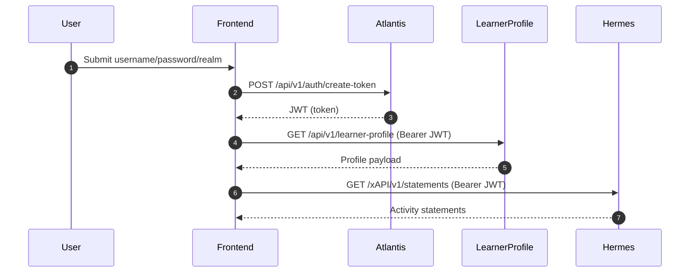
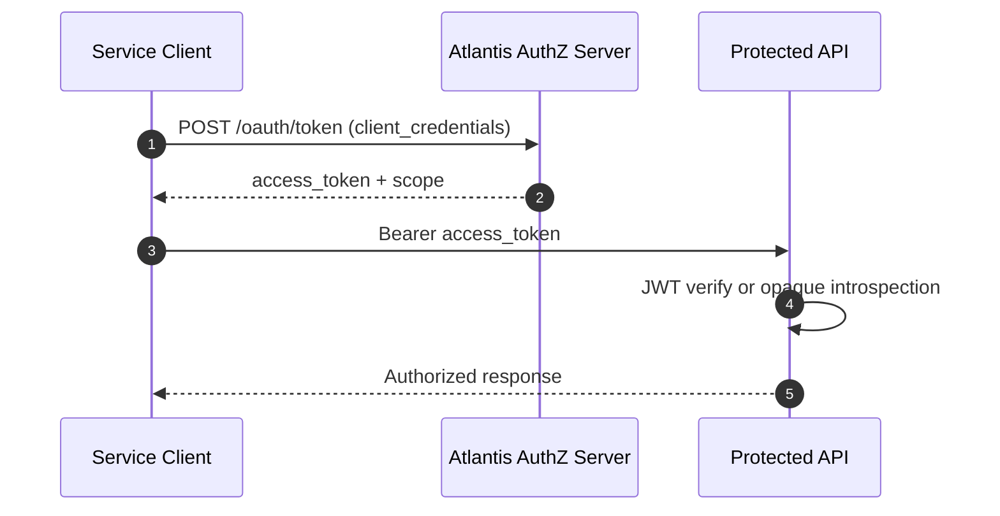

# 06 - Authentication and Authorization Flow

## 1) Purpose
This document explains how authentication and authorization work end-to-end across Atlantis, Apollo, Hermes, learner-profile backend, and frontends.

## 2) Identity models used in the platform
- User JWT model: Atlantis issues signed JWTs for user sessions at /api/v1/auth/create-token.
- OAuth2 client-credentials model: Atlantis authorization server issues access tokens at /oauth/token for service clients.
- Opaque token model: some resource-server paths accept bearer tokens via introspection.
- SID bridge model: selected Atlantis endpoints can exchange sid -> jwt before authorization checks.

## 3) Atlantis authentication entry points

## 3.1 User login (username/password)
- JwtAuthenticationFilter is bound to /api/v1/auth/create-token.
- Filter reads realm, username, password from request body.
- On success, Atlantis generates JWT via JwtUtility.generateToken().
- Token includes user and context claims plus sec_hash.

## 3.2 OAuth2 client token issuance
- AuthorizationServerConfig maps token endpoint to /oauth/token.
- Registered clients are loaded from DB via JdbcRegisteredClientRepository.
- Access token response includes scope claim materialized into response additionalParameters.

## 3.3 OAuth-assisted user token creation
- OauthAuthenticationController exposes /api/v1/oauth/create-token.
- Endpoint requires OAuth-authenticated client context and can mint user JWT by userId + realm + appType.

## 4) Atlantis authorization and token validation behavior

## 4.1 Dual filter-chain model
- BecResourceServerConfiguration (order 1):
  - applies to /api/v1/oauth/** and /api/v1/auth/create-token
  - permits create-token endpoint
  - protects /api/v1/oauth/** with OAuth client authorization manager
- WebSecurity chain (order 2):
  - applies broadly to remaining API paths
  - uses JwtAuthorizationFilter before bearer-token authentication filter

## 4.2 Signed JWT vs opaque bearer handling
- If bearer token is signed JWT: JwtAuthorizationFilter parses and validates claims.
- If bearer token is not signed JWT: request continues to OAuth2 resource-server opaque token introspection.
- OpaqueTokenIntrospectionConfig defines:
  - local authorization-server introspector
  - remote introspector for configured introspection URI

## 4.3 Security-hash check
- JWT contains sec_hash derived from parsed IP + User-Agent + salt.
- Validation recomputes sec_hash and rejects mismatch when feature flag is enabled.

## 5) Apollo authentication and authorization behavior

## 5.1 Middleware strategy
- check_oauth_jwt middleware:
  - first tries logged-in JWT user context
  - falls back to OAuth resource-server validation
- oauth_client middleware:
  - validates OAuth client token only
- auth middleware:
  - standard authenticated-user requirement for protected endpoints

## 5.2 Practical effect
- Apollo supports mixed client and user token patterns in different route groups.
- This allows internal service calls and user-session calls to coexist.

## 6) Hermes authentication and authorization behavior
- LrsSecurityConfiguration installs JwtAuthorizationFilter for authenticated routes.
- /actuator/** is public; xAPI routes require authentication.
- Optional authz manager can enforce policy checks on state endpoints when enabled.

## 7) Learner-profile backend authentication and authorization behavior

## 7.1 Incoming request auth
- JwtAuthorizationFilter validates signed JWT-bearing requests.
- Unsinged bearer tokens can pass through for alternate auth patterns where configured.
- sec_hash verification logic mirrors Atlantis behavior behind feature flag.

## 7.2 Service-to-service token operations
- /jwt/token endpoint proxies AuthN token generation using client credentials.
- AuthnService uses Feign client to call AuthN /jwt/token and /jwt/token/status.

## 8) Frontend token usage patterns
- Athena cmi5player:
  - generates JWT from sid (GET_JWT_BY_SID path)
  - request interceptor injects bearer header from request.jwt
- learner-profile frontend:
  - login screen posts to Atlantis auth endpoint
  - token is stored and passed to service wrappers for API calls
- Metis frontend:
  - axios interceptor pulls token from persisted auth state

## 9) End-to-end request paths (summary)

## 9.1 User login and profile data

## 9.2 Service client token and OAuth-protected call

## 10) Interview talking points
- The platform intentionally supports multiple auth contracts (user JWT, OAuth client token, opaque introspection) for backward compatibility and service interoperability.
- Atlantis acts as auth hub with split chains and token-path specialization.
- Apollo middleware composition is a concrete example of mixed auth acceptance at route-level.
- Security hash is a compensating control for token replay risk when traffic context changes.

## 11) Known complexity and risks
- Multiple token types increase operational and debugging complexity.
- Route-level middleware differences can cause inconsistent auth behavior across endpoints.
- sec_hash depends on network path/user-agent consistency; proxies may affect reliability if headers are not normalized.

## 12) Evidence files reviewed
- atlantis/src/main/java/atlantis/config/BecResourceServerConfiguration.java
- atlantis/src/main/java/atlantis/config/WebSecurity.java
- atlantis/src/main/java/atlantis/config/JwtAuthenticationFilter.java
- atlantis/src/main/java/atlantis/config/JwtAuthorizationFilter.java
- atlantis/src/main/java/atlantis/config/AuthorizationServerConfig.java
- atlantis/src/main/java/atlantis/config/OpaqueTokenIntrospectionConfig.java
- atlantis/src/main/java/atlantis/oauth/controller/OauthAuthenticationController.java
- atlantis/src/main/java/atlantis/utility/JwtUtility.java
- apollo/routes/web.php
- apollo/app/Http/Middleware/CheckOauthOrJwt.php
- apollo/app/Http/Middleware/OAuthClient.php
- hermes/backend/lrs-app/src/main/java/com/benchmarkuniverse/lrs/security/LrsSecurityConfiguration.java
- learner-profile/backend/learner-profile-app/src/main/java/com/benchmarkuniverse/learnerprofile/config/JwtAuthorizationFilter.java
- learner-profile/backend/learner-profile-app/src/main/java/com/benchmarkuniverse/learnerprofile/controller/OauthTokenController.java
- learner-profile/backend/learner-profile-app/src/main/java/com/benchmarkuniverse/learnerprofile/externalcalls/authn/service/AuthnService.java
- learner-profile/backend/learner-profile-app/src/main/java/com/benchmarkuniverse/learnerprofile/externalcalls/authn/service/AuthnClient.java
- athena/frontend/cmi5player/src/redux/middleware/appMiddleware.js
- athena/frontend/cmi5player/src/utils/api/interceptor.js
- learner-profile/frontend/student-profile/src/containers/Login/index.jsx
