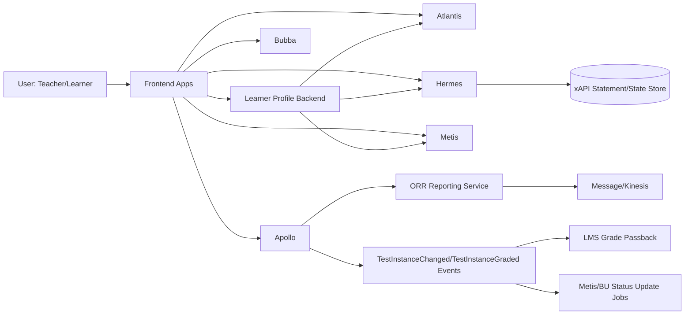

# 08 - Business Flows

## 1) Purpose
This document describes business-level product flows across the BU-Curve platform, mapped to concrete service boundaries.

## 2) Primary business capabilities
- Identity and session bootstrap for learners/teachers.
- Assignment creation and distribution.
- Assessment delivery and completion tracking.
- Teacher-led and observational assessment workflows.
- Learner profile analytics and progress visibility.
- Reporting, downstream status propagation, and LMS grade passback.

## 3) Cross-service business swimlane

## 4) Business flow A: User access and role-aware experience
1. User authenticates from frontend.
2. Atlantis issues token and user context claims.
3. Frontends call domain APIs (Apollo/Hermes/Metis/Learner-profile).
4. Service-level authorization and policy checks gate actions (student/teacher/admin).

Business value:
- Unified cross-application access with role-sensitive behavior.

## 5) Business flow B: Assignment creation and distribution
1. Upstream assignment context is prepared in Metis/related systems.
2. Apollo creates test assignment + test instances via instances/create APIs.
3. Assignment metadata includes district/school/class/student scope and component/sku details.
4. Learners receive assignment-linked launch paths through frontend integration.

Business value:
- Consistent assignment orchestration across classes and products.

## 6) Business flow C: Learner takes assessment
1. Frontend loads assignment/test instance and assessment items.
2. Learner responses are saved per interaction.
3. Submit action transitions status to submitted and triggers grading pipeline.
4. Status changes emit events for downstream updates.

Business value:
- Durable per-item response tracking with eventual grading and status consistency.

## 7) Business flow D: Teacher-led assessment operations
1. Teacher retrieves summary/history by class/group.
2. Teacher creates, updates, deletes, restores, and reviews teacher-led assignments.
3. Student/subtest progression and historical views are generated from aggregated assignment data.

Business value:
- Supports guided, formative teacher workflows beyond standard test-taking.

## 8) Business flow E: ORR and reporting outcomes
1. ORR assignment update/submit operations change completion and grading states.
2. ORR events invoke reporting listeners.
3. Reporting service builds normalized snapshots and publishes messages.
4. Rubric-specific reporting can be split or combined by environment flags.

Business value:
- Near-real-time reporting payload generation for analytics/report consumers.

## 9) Business flow F: Grade passback and external LMS sync
1. Graded test instance emits TestInstanceGraded.
2. Listener computes percentage and gathers LMS integration metadata.
3. Passback route selected by LMS type and configuration (Janus/direct integrations).
4. LMS receives grade signal and updates external gradebook.

Business value:
- Reduces teacher overhead by synchronizing grades into LMS systems.

## 10) Business flow G: Learner profile analytics view
1. Learner-profile frontend loads selection context (school/class/student).
2. Backend and frontend services aggregate:
  - Atlantis user and collective metadata
  - Hermes activity/login patterns
  - Metis assignment summary
  - learner-profile standards/skills progression
3. UI presents profile and trend widgets.

Business value:
- Student growth and activity insights in one teacher-facing view.

## 11) Business constraints and operational tradeoffs
- Multi-service dependency chain raises failure-propagation risk.
- Mixed token and middleware models require strong API contract governance.
- Feature flags and environment-specific behavior can diverge across deployments.

## 12) Interview-ready narrative
- The platform is not only test delivery; it is a full learning operations pipeline:
  - identity -> assignment -> interaction capture -> grading -> reporting -> passback -> profile insights.
- Apollo is the operational center for assessment workflows.
- Atlantis anchors identity and user-domain context.
- Hermes captures learning telemetry state and statements.

## 13) Evidence files reviewed
- apollo/routes/web.php
- apollo/app/Http/Controllers/TestInstanceController.php
- apollo/app/Http/Controllers/TestItemInteractionInstanceController.php
- apollo/app/Http/Controllers/TeacherLedAssessmentController.php
- apollo/app/Services/MetisApi/MetisApiService.php
- apollo/app/Events/TestInstanceChanged.php
- apollo/app/Events/TestInstanceGraded.php
- apollo/app/Providers/EventServiceProvider.php
- apollo/app/Listeners/ProcessBUTestInstanceUpdates.php
- apollo/app/Listeners/PushGradePassback.php
- apollo/app/Events/Reporting/ORR/OrrReportingEvent.php
- apollo/app/Listeners/Reporting/ORR/OrrReportingListener.php
- apollo/app/Events/Reporting/ORR/OrrRubricReportingEvent.php
- apollo/app/Listeners/Reporting/ORR/OrrRubricReportingListener.php
- apollo/app/Services/Reporting/OrrReportingService.php
- atlantis/src/main/java/atlantis/config/WebSecurity.java
- hermes/backend/lrs-app/src/main/java/com/benchmarkuniverse/lrs/controller/StatementExtensionController.java
- learner-profile/frontend/student-profile/src/Main.js
