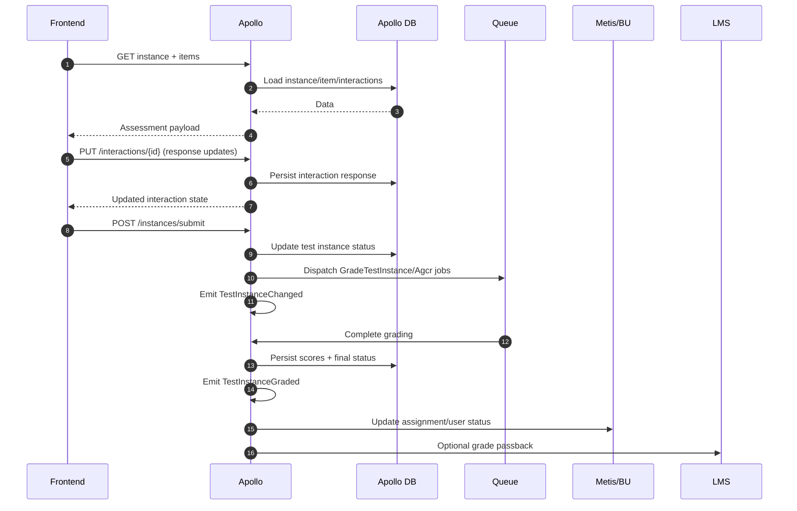
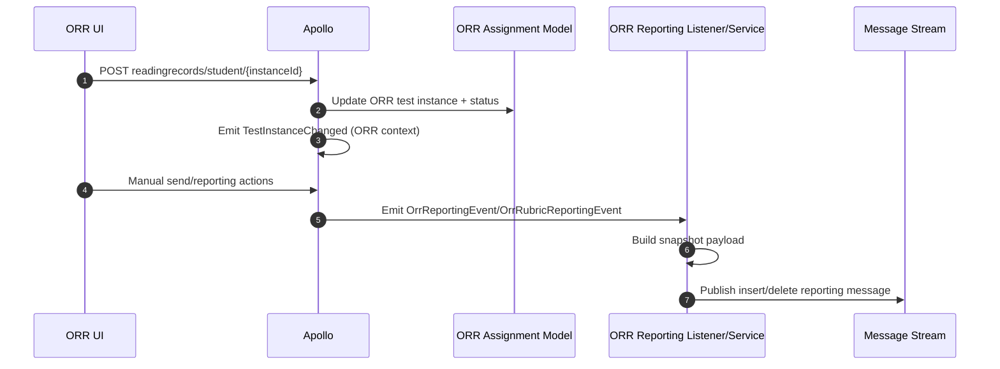

# 09 - Assessment Flow

## 1) Purpose
This document traces the assessment lifecycle from assignment provisioning through response capture, grading, status propagation, and reporting side effects.

## 2) Core entities in the flow
- Test Assignment: grouping of student-targeted assessment instances.
- Test Instance: learner-specific assessment execution record.
- Test Item Instance: per-item record under a test instance.
- Test Item Interaction Instance: per-interaction response/score record.
- Status model: NOT_STARTED -> IN_PROGRESS -> SUBMITTED -> NEEDS_REVIEW/GRADED -> RELEASED.

## 3) Route-level assessment entry points (Apollo)
- Assignment/instance retrieval and item fetch routes under /assignments and /instances.
- Interaction update/manual scoring routes under /interactions.
- Submission routes:
  - /instances/submit
  - /instances/submit-linear-test
  - ORR student submit endpoints in readingrecords/student.
- Batch status/grade operations:
  - /instances/status
  - /instances/grade

## 4) End-to-end standard assessment flow

## 5) Controller and service chain details

## 5.1 submitTest flow
- Validates assessmentItems + user payload.
- Calls update() to save status/state fields.
- Updates interaction responses through TestInstanceService.
- Calls gradeQuestion() to enforce status/grading behavior.
- Optionally dispatches AGCR job for enabled configurations.

## 5.2 interaction update flow
- TestItemInteractionInstanceController.update:
  - validates and persists response/identifier
  - enforces auth via Gate policy
  - supports score/manual override/autograde acceptance logic
  - can execute question-by-question grading paths
  - can dispatch AGCR jobs for audio/autograde scenarios

## 5.3 linear submission flow
- submitLinearTest updates test-taker state and submitted timestamps.
- gradeQuestion decides immediate grading vs needs-review transitions.

## 6) Status transition logic highlights
- addDateTimesForStatus populates ti_submitted_at and ti_released_at by state.
- updateBuTestInstancesStatuses handles batch transitions and graded-event emission.
- Graded transition triggers TestInstanceGraded for passback integrations.

## 7) Async grading and side effects
- GradeTestInstance job:
  - executes autograde service
  - updates instance/item scores
  - can auto-release in specific paths
- ProcessBUTestInstanceUpdates listener:
  - maps instance statuses to BU/Metis status updates
  - dispatches queue jobs for status synchronization
- PushGradePassback listener:
  - computes normalized grade value
  - sends LMS-specific passback payloads

## 8) ORR-specific flow

ORR specifics:
- Completion and graded state influence whether insert or delete reporting message is sent.
- Rubric reporting can run on separate message connection by environment configuration.

## 9) Assessment flow with next-component progression
- For completed/submitted contexts, Apollo can call Bubba to derive sid from token.
- Apollo then uses Metis APIs to update learner status and resolve next component.
- If next component exists, assignment/test instances can be provisioned for continuation.

## 10) Failure handling and edge cases
- Unauthorized access blocked by Gate/policy checks.
- Missing instances return not-found responses.
- Metis/LMS integration failures are logged; some paths fall back to legacy status jobs.
- Incomplete grading states are monitored and can be remediated by follow-up logic/jobs.

## 11) Interview-ready explanations
- Assessment flow is state-machine driven, with explicit transition timestamps.
- Response capture is granular at interaction level, enabling partial save and rich analytics.
- Grading and downstream synchronization are decoupled through events and queues.
- ORR is a specialized extension with dedicated reporting event pipelines.

## 12) Evidence files reviewed
- apollo/routes/web.php
- apollo/app/Http/Controllers/TestInstanceController.php
- apollo/app/Http/Controllers/TestItemInteractionInstanceController.php
- apollo/app/Jobs/GradeTestInstance.php
- apollo/app/Events/TestInstanceChanged.php
- apollo/app/Events/TestInstanceGraded.php
- apollo/app/Providers/EventServiceProvider.php
- apollo/app/Listeners/ProcessBUTestInstanceUpdates.php
- apollo/app/Listeners/PushGradePassback.php
- apollo/app/Services/TestInstance/TestInstanceService.php
- apollo/app/Services/MetisApi/MetisApiService.php
- apollo/app/Events/Reporting/ORR/OrrReportingEvent.php
- apollo/app/Listeners/Reporting/ORR/OrrReportingListener.php
- apollo/app/Events/Reporting/ORR/OrrRubricReportingEvent.php
- apollo/app/Listeners/Reporting/ORR/OrrRubricReportingListener.php
- apollo/app/Services/Reporting/OrrReportingService.php
