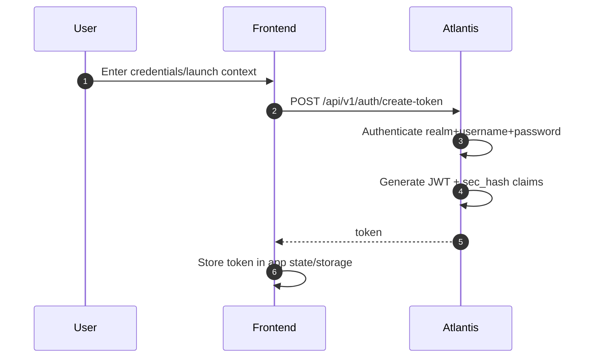
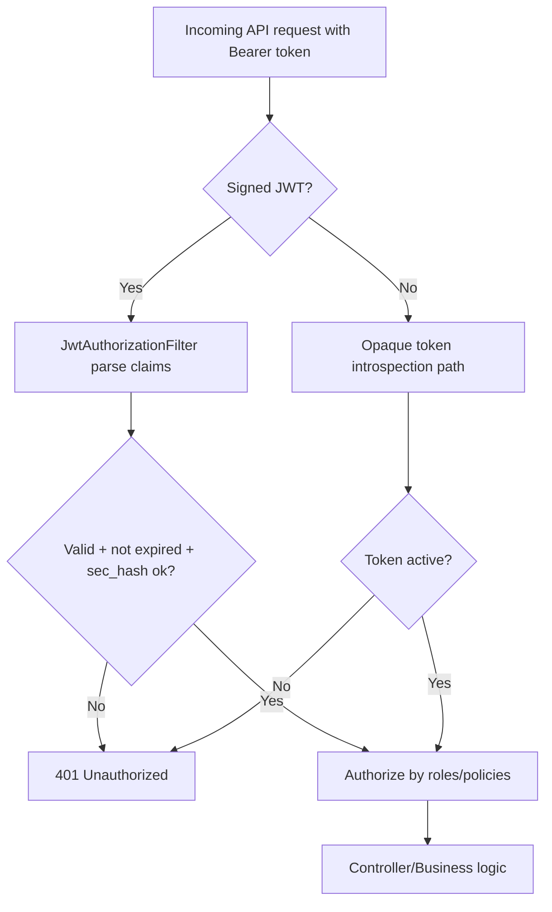
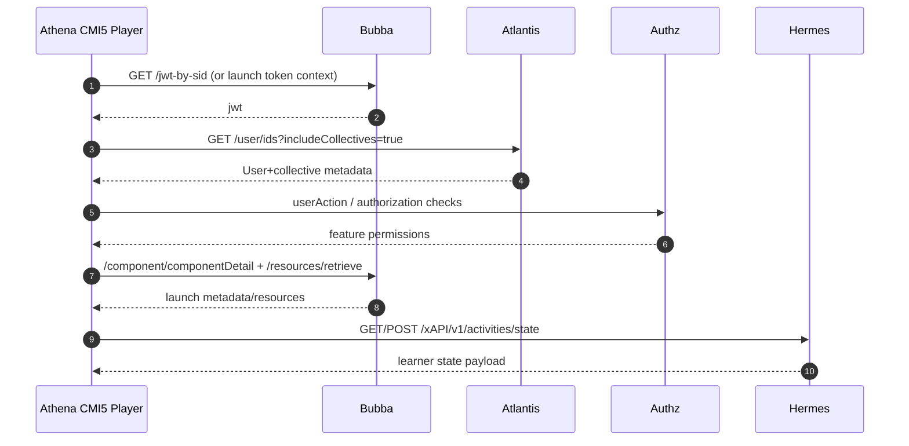
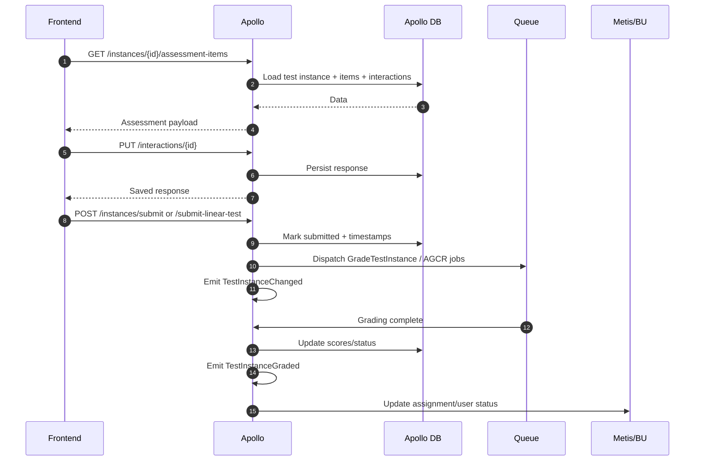
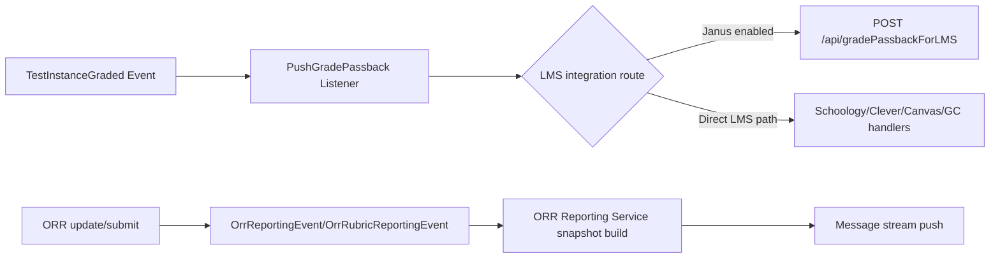
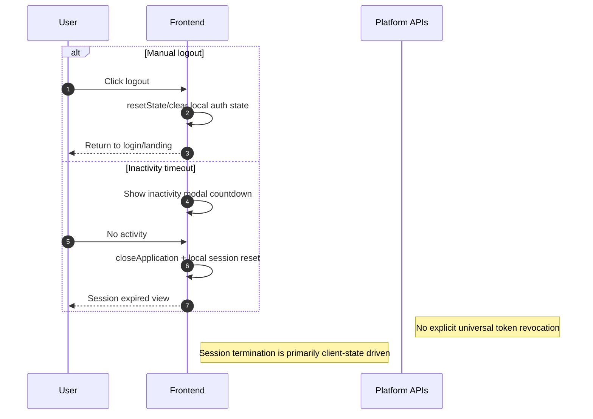

# 10 - Data Flow Diagrams

## 1) Purpose
This document provides diagram-driven traces for the requested flows:
- login
- authentication/authorization
- content launch and retrieval
- assessment submission and grading
- reporting/passback
- logout/session-end behavior

## 2) Login and authentication flow

## 3) Authentication + authorization decision flow

## 4) Content launch and content data flow

## 5) Assessment execution and grading flow

## 6) Reporting and grade-passback flow

## 7) Logout/session-end flow

## 8) Data classification by flow
- Identity/session data: user credentials, JWTs, sid context, role/collective claims.
- Content data: launch URLs, component metadata, resources, user preferences.
- Assessment data: instance status, item responses, interaction scores, comments.
- Telemetry data: xAPI statements and activity state documents.
- Reporting data: ORR snapshots, grade passback payloads, status propagation updates.

## 9) Observations
- The platform uses a hybrid of synchronous user-request flows and asynchronous event/queue side effects.
- Authentication is centralized but enforcement is distributed per service/middleware chain.
- Logout is mostly app-state/session behavior rather than a single platform-wide revoke endpoint.

## 10) Evidence files reviewed
- atlantis/src/main/java/atlantis/config/BecResourceServerConfiguration.java
- atlantis/src/main/java/atlantis/config/WebSecurity.java
- atlantis/src/main/java/atlantis/config/JwtAuthenticationFilter.java
- atlantis/src/main/java/atlantis/config/JwtAuthorizationFilter.java
- apollo/routes/web.php
- apollo/app/Http/Controllers/TestInstanceController.php
- apollo/app/Http/Controllers/TestItemInteractionInstanceController.php
- apollo/app/Listeners/PushGradePassback.php
- apollo/app/Listeners/Reporting/ORR/OrrReportingListener.php
- apollo/app/Listeners/Reporting/ORR/OrrRubricReportingListener.php
- hermes/backend/lrs-app/src/main/java/com/benchmarkuniverse/lrs/controller/StatementExtensionController.java
- hermes/backend/lrs-app/src/main/java/com/benchmarkuniverse/lrs/controller/StateController.java
- athena/frontend/cmi5player/src/utils/constants.js
- athena/frontend/cmi5player/src/utils/api/interceptor.js
- athena/frontend/cmi5player/src/components/BuInactivityModal/index.jsx
- learner-profile/frontend/student-profile/src/Main.js
