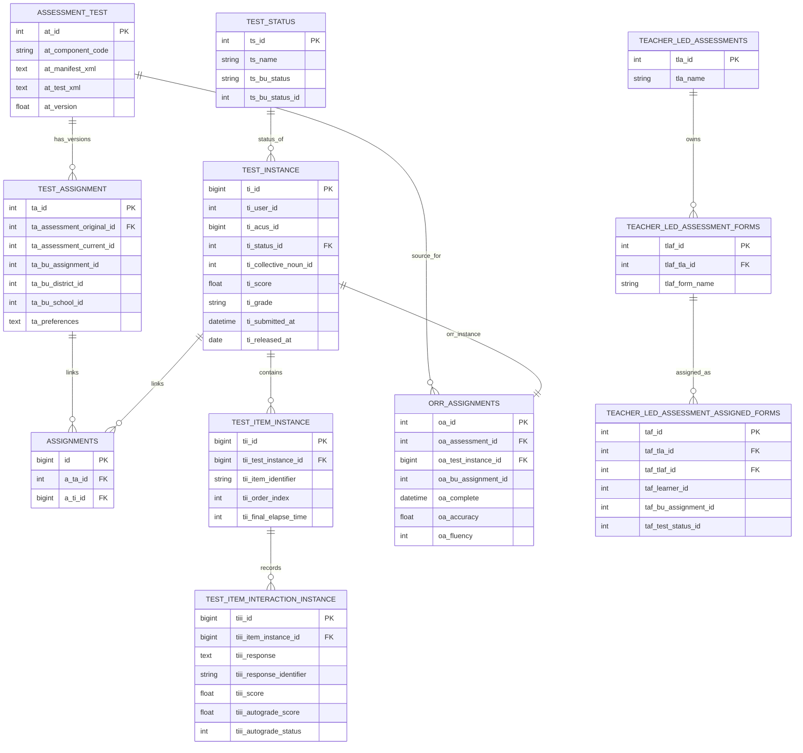
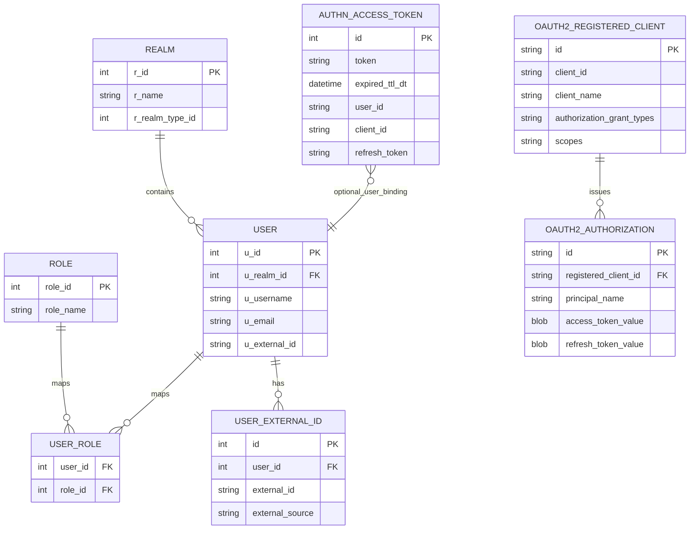
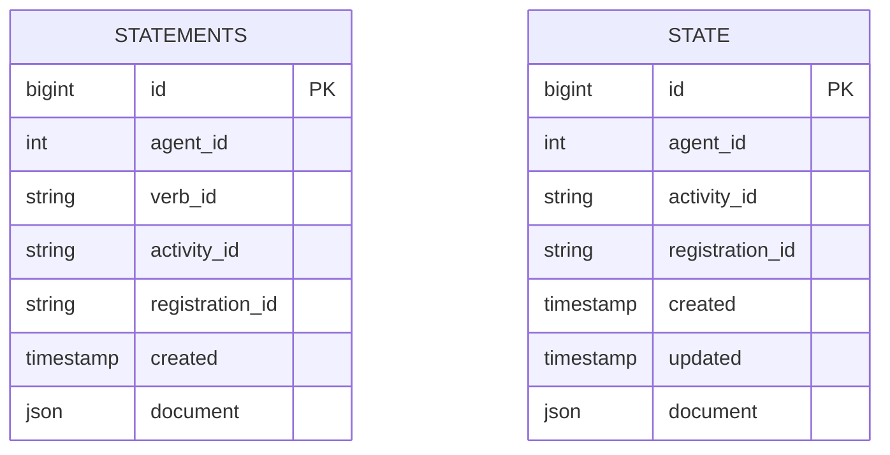

# 11 - Database and ERD

## 1) Scope and caveat
This ERD is a practical interview-focused data model synthesis from schema and migration files reviewed in this workspace. It is not an exhaustive dump of every table in each service.

## 2) Primary data stores by service
- Atlantis (gypsum): identity, realms, users, roles, OAuth/OIDC and authn token persistence.
- Apollo (marble): assessments, assignments, instances, interactions, ORR and teacher-led artifacts.
- Hermes (granite): xAPI statements and activity state JSON documents.
- Learner-profile backend: API/service layer reviewed; direct DB schema artifacts were not discovered in this workspace snapshot.

## 3) Apollo core ERD

## 4) Atlantis identity/token ERD (selected)

## 5) Hermes telemetry ERD

## 6) Data lifecycle summary
- Atlantis:
  - creates and validates user/auth client token context.
  - persists OAuth2 authorization records and authn token records.
- Apollo:
  - stores assessment definitions and test execution state.
  - updates interaction-level responses and computed scores.
  - feeds downstream reporting and status synchronization.
- Hermes:
  - stores xAPI statement and state documents for learning telemetry and resume context.

## 7) Indexing and scale indicators observed
- Atlantis has targeted indexes for user identity lookups and token identifiers.
- Apollo has indexes around status/time and relationship joins on instance/interactions.
- Hermes has registration and agent-registration indexes for statement/state retrieval.

## 8) Interview talking points
- The strongest data backbone is in Apollo where operational assessment state is normalized from assignment to interaction granularity.
- Atlantis combines identity domain tables with evolving OAuth2 authorization-server persistence.
- Hermes intentionally uses JSON document columns to preserve xAPI payload shape while still indexing common lookup keys.

## 9) Evidence files reviewed
- apollo/database/schema/Marble.sql
- apollo/database/migrations/2023_09_12_123126_create_test_assignment_table.php
- apollo/database/migrations/2023_09_12_123127_create_assignments_table.php
- apollo/database/migrations/2023_09_12_123108_create_test_instance_table.php
- apollo/database/migrations/2023_09_12_123109_create_test_item_instance_table.php
- apollo/database/migrations/2023_09_12_123110_create_test_item_interaction_instance_table.php
- apollo/database/migrations/2023_09_12_123154_create_orr_assignments_table.php
- apollo/database/migrations/2023_09_12_123235_create_teacher_led_assessment_assigned_forms_table.php
- atlantis/src/main/resources/db/migration/V1__Initial.sql
- atlantis/src/main/resources/db/migration/V28__OAuth2Migration.sql
- atlantis/src/main/resources/db/Create_AuthN_Access_Token.sql
- hermes/backend/lrs-app/src/main/resources/db/migration/V1__Initial.sql
