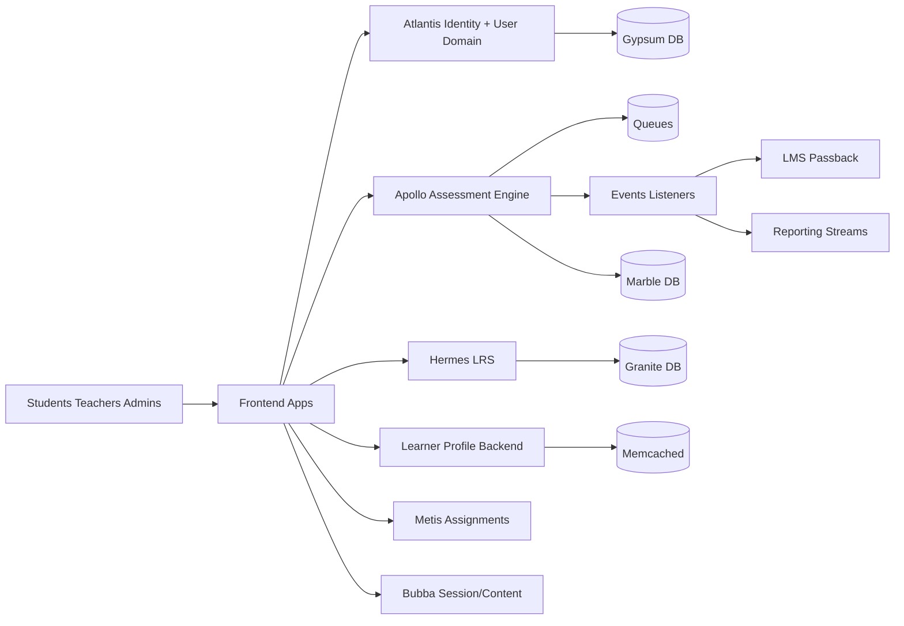

# 13 - System Design

## 1) Goal of the design
Deliver a multi-product learning platform that supports:
- secure user/session access
- assignment and assessment delivery at scale
- learner telemetry collection
- reporting and LMS passback integrations
- profile analytics views for educators

## 2) System context

## 3) Architectural style
- Distributed domain services with explicit responsibility boundaries.
- API-first synchronous request paths for user-facing interactions.
- Event/queue-driven asynchronous paths for grading, status updates, passback, and reporting.
- Environment-driven service endpoint composition on frontend clients.

## 4) Bounded contexts
- Atlantis:
  - identity
  - authorization primitives
  - user/collective/preference domains
- Apollo:
  - assessment runtime state machine
  - interaction persistence
  - grading orchestration
  - ORR and teacher-led variants
- Hermes:
  - xAPI statement/state persistence
  - telemetry enrichment/forwarding
- Learner-profile:
  - learner progression and standards views
  - analytics-focused aggregation APIs

## 5) Request flow decomposition

## 5.1 Control-plane flow
- token issuance and validation
- policy and role checks
- feature-level authorization checks

## 5.2 Data-plane flow
- assessment content/resource load
- interaction response persistence
- status updates and score calculation
- telemetry state/statement capture

## 6) State management design
- Assessment state is explicit and timestamped (status transitions in Apollo).
- Interaction-level updates allow partial progress and resumability.
- xAPI state in Hermes complements assessment persistence for runtime context continuity.

## 7) Integration design patterns
- Direct synchronous REST calls for immediate UX outcomes.
- Event listeners for decoupled side effects.
- Queue workers for potentially long-running scoring jobs.
- Adapter-like LMS passback branching by source LMS type and feature flags.

## 8) Scalability considerations
- Stateless API services with externalized state (DB/cache/queue).
- Hot-path caching patterns exist for token and some assignment metadata.
- DB index strategy in schemas indicates tuning around assignment and interaction joins.
- Async grading/offline side effects reduce p95 latency pressure on submit endpoints.

## 9) Reliability and failure domains
- Failure in optional side effects (passback/reporting) should not block primary assessment response capture.
- Multi-hop dependency chains create cascading risk if retries/backoff/circuit controls are weak.
- Hybrid token validation paths improve compatibility but complicate observability.

## 10) Security design summary
- JWT and OAuth client token models coexist.
- Signed JWT and opaque token introspection paths both supported in Atlantis security chains.
- Optional sec_hash binding adds replay resistance signal at request validation time.

## 11) Tradeoffs
- Benefit: flexible interoperability with legacy and modern clients.
- Cost: higher complexity in route-specific auth behavior and debugging.
- Benefit: asynchronous side effects improve responsiveness.
- Cost: eventual consistency windows for status/passback/reporting.

## 12) Interview-ready system design storyline
1. Start with domain boundaries and why they exist.
2. Explain the primary assessment request path.
3. Explain async side effects and consistency model.
4. Explain auth model diversity and migration reality.
5. Close with reliability and security improvement roadmap.

## 13) Suggested design evolution
- Consolidate token strategy and standardize auth contracts.
- Add stronger distributed tracing across event and queue boundaries.
- Expand contract tests for frontend-to-service integration points.
- Introduce replay-safe refresh-token rotation if centralized auth endpoint supports it.

## 14) Evidence files reviewed
- docs/project-understanding/03-high-level-architecture.md
- docs/project-understanding/05-backend-and-microservices.md
- docs/project-understanding/06-authentication-authorization-flow.md
- docs/project-understanding/09-assessment-flow.md
- atlantis/src/main/java/atlantis/config/WebSecurity.java
- atlantis/src/main/java/atlantis/config/BecResourceServerConfiguration.java
- apollo/app/Http/Controllers/TestInstanceController.php
- apollo/app/Jobs/GradeTestInstance.php
- apollo/app/Providers/EventServiceProvider.php
- hermes/backend/lrs-app/src/main/java/com/benchmarkuniverse/lrs/security/LrsSecurityConfiguration.java
- learner-profile/backend/learner-profile-app/src/main/java/com/benchmarkuniverse/learnerprofile/security/LearnerProfileSecurityConfiguration.java
