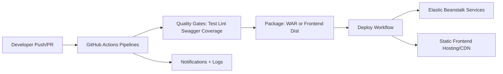

# 14 - Deployment and CI/CD

## 1) Purpose
This document explains build, test, quality-gate, and deployment flows across key BU-Curve services.

## 2) Pipeline design pattern across repos
Common pattern:
1. determine environment/branch variables
2. run quality gates (tests, lint, swagger validation as applicable)
3. package artifact
4. deploy to environment target (Elastic Beanstalk or static deploy)
5. notify on success/failure

Reusable workflow strategy:
- Multiple repositories consume centralized reusable workflows from benchmarkeducation/github-workflows.
- This standardizes environment mapping and deployment behavior.

## 3) Atlantis backend pipeline
- Triggered on PR, release, and release/** pushes.
- Jobs:
  - determineCIVariables
  - validate-swagger (docs/swagger.yml)
  - gradle-test (Java 21, Gradle, MySQL service)
  - buildAndDeploy (WAR to Elastic Beanstalk)
- Quality controls:
  - tests + JaCoCo report + coverage verification
  - swagger validation before build/deploy

## 4) Apollo backend pipeline
- Triggered on PR, release, and release/** pushes.
- Jobs:
  - determineCIVariables
  - validate_swagger
  - lint (PHP 8.2)
  - test (PHPUnit with MySQL schema bootstrapping)
  - buildAndDeploy (Elastic Beanstalk)
- Testing setup details:
  - provisions MySQL 5.7
  - loads Marble schema and dependent SQL snapshots
  - executes PHPUnit with coverage output
- Deployment behavior:
  - environment-conditional deployment
  - explicit Teams notifications for fail/success paths

## 5) Hermes backend pipeline
- Triggered on PR (backend path scoped), release, and release/** pushes.
- Jobs:
  - determineCIVariables
  - gradle-test (Java 21)
  - buildAndDeploy via reusable Gradle WAR -> Elastic Beanstalk workflow

## 6) Learner-profile backend pipeline
- Triggered on PR (backend path scoped), release, and release/** pushes.
- Jobs:
  - determineCIVariables
  - test via reusable gradle-test workflow
  - buildAndDeploy (learner-profile-app.war to Elastic Beanstalk)

## 7) Learner-profile Flyway pipeline
- Dedicated flyway workflow for SQL migrations.
- Uses AWS SSM Parameter Store to resolve environment-specific DB connection details.
- Executes flyway repair then flyway migrate.
- Clears local flyway.conf artifacts after execution.

## 8) Athena cmi5player frontend pipeline
- Triggered on PR (frontend path scoped), release, and release/** pushes.
- Jobs:
  - determineCIVariables (distribution key enabled)
  - test via reusable yarn test workflow (Node 20.15.1)
  - lint via reusable yarn lint workflow
  - buildAndDeploy via reusable yarn build/deploy workflow
- Deploy target:
  - built dist assets uploaded to configured deploy destination path.

## 9) Deployment topology summary

## 10) Quality gates and policy implications
- Swagger contract validation reduces API drift risk.
- Coverage checks enforce minimum test rigor for Java services.
- Linting and unit tests run before deploy path activation.
- Environment and branch rules constrain when production/staging deploys can occur.

## 11) Operational strengths
- Reusable workflows reduce pipeline entropy across repositories.
- Path-scoped triggers avoid unnecessary runs.
- Explicit environment-aware branching logic supports multi-stage rollout.

## 12) Risks and improvement opportunities
- Shared workflow version pinning to mutable branch names can introduce unexpected changes.
- Pipeline complexity in Apollo deploy logic may be harder to reason about during incident response.
- Add consistent SBOM/dependency vulnerability scans if not already enforced externally.

## 13) Interview talking points
- CI/CD is standardized through reusable workflow contracts, not copy-pasted YAML.
- Backend services converge on test -> coverage -> deploy pipelines with environment mapping.
- Frontend pipelines align with test/lint/build/deploy and branch-aware release controls.
- Database migrations are handled as a first-class deployment concern (Flyway workflow).

## 14) Evidence files reviewed
- atlantis/.github/workflows/config.yml
- apollo/.github/workflows/backend.yml
- hermes/.github/workflows/backend.yml
- learner-profile/.github/workflows/learner-profile-app-gradle-backend.yml
- learner-profile/.github/workflows/flyway.yml
- athena/.github/workflows/cmi5player-standalone-react-frontend.yml
